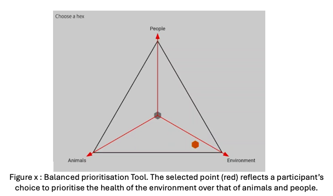
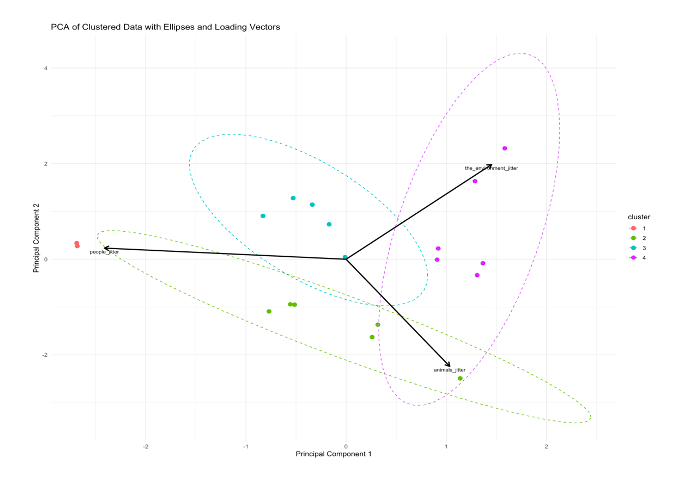

# Balanced Prioritisation Tool for One Health Research

One Health is an interdisciplinary approach that recognizes the interconnectedness of human, animal, and environmental health. 

We created these tools to support our One Health research and in particular as part of our 'Oneography' study in Rokupr, Sierra Leone. A neologism, Oneography is an approach which uses descriptive, analytical and statistical methods to explore the perspectives of many stakeholders within the One Health framework. This study integrates both qualitative and quantitative approaches and aims to understand the relative prioritisations of One Health pillars in different sectors of a place, community or society.

The research instrument presented here is a 'game' for one or more player. This includes printed aluminium gameboards and 3D printed play-pieces.

The main purpose is to provide a framework for researchers to have conversations with stakeholders by using a tool which forces them to make a choice that balances resources between the various pillars of one health or actors involved in governance of One Health. The player(s) move one or more pawns around the board, and movement towards one corner shows their heightened valuation of that 'pillar'. This comes at a cost to the other two aspects. The final placement of the pawn is recorded using an image-map within and ODK form. In keeping with our Oneography method, the process of discussion, movement and collaboration when making judgement decisions is as much a part of the research as the quantitative measure of the final pawn placements. 

Core to the function of the quantitative aspect is the use of an SVG 'image-map' which is an interactive image that allows pawn placements on the real-world game board to be recorded on a digital twin within an ODK XLSForm. 

## Game Boards

We created two game boards, one which balances proritisation of animal, human and environmental health; the other which balances the roles of government, communities and industry. 
The game boards were designed in Affinity Designer with imagery created by Dall-E by ChatGPT.

## Play Pieces
We created home made play pieces using a 2 colour 3D printer. OpenSCAD and STL files for these pieces are included in [3D_Printing_Designs](3D_Printing_Designs)

## Image Maps

We created a python script to generate the core hexagon matrix that serves as the central game-space. 
This is a customisable python script which creates an SVG for image-map type questions in ODK Ecosystem platforms.

[python_script_generate_hexmap/trigram_generator_hexagons_central_origin.py](python_script_generate_hexmap/trigram_generator_hexagons_central_origin.py)

If you need a differently sized game-board, you can modify the matrix by changing the settings in the python code. 

Using Inkscape and BBEDit, we modified the image maps to include colour. The presence of colours really helps when transliterating data from the game board to the ODK Form. 

## How the Image Map works

The [python_script](python_script_generate_hexmap/trigram_generator_hexagons_central_origin.py) creates a ternary diagram with three variables. The main triangle consists of a 19x19 hexagonal map.

In ODK, the hexagons (which are painted transparently in SVG) become clickable and are mapped to a co-ordinate system which measures the triangular distance from the central hexagon. 

The coordinates are a Hamming distance metric, so the furthest extreme corners are 12 edges away from the central point.

The topmost apex is then the three vertexes are at 

top   :  -6,-6,12  
left  :  -6,12,-6  
right :  12,-6,-6  

As you can see, a higher value in one vertex is associated with a lower score in the other two dimensions.

This means that the scores on each 'axis' are not numerically important per se, but rather that the relationships between the numbers mean something
It also provides for a pretty easy to understand visual device.

## ODK XLSForm Template
We include a [template XLSForm](OneHealth_BPA.xlsx) which can be used to interface between the real world boards and your ODK Server. (Also works with KoBo Toolbox etc). 

https://github.com/user-attachments/assets/07cac882-ebab-4b1c-a995-7735a688102c

You can  easily transpose this to a square chart by doubling all the negative numbers on account of those coming from the side of the triangle that's half as long as the other one. 

## Analysis

We include a [template analysis](Example_Analysis/) in R / QMD

The three axes of the triangle (originating in the centre) represent one of three aspects that could be prioritised. An example question might be “If the government had money for spending on your city, how much should they spend on each of human health, animal health and environmental health?”.  The three aspects can be changed to support asking questions about any three linked factors. 

 

The participant is asked to touch the screen in a place which they feel represents the ideal balance of prioritisations given the context of the question. Selected points closer to the vertices represent greater prioritisation of one aspect (at the cost of deprioritising the other two aspects), whilst points in the centre reflect more balanced prioritisations. 
The data are stored in a coordinate system originating from the central point (0,0,0) to the three vertices (12,-6,-6 | -6,12,-6 | -6,-6,12). Each point is stored as a coordinate, with linked demographic data that can be used to form groups of data points from different classes of participant (men, women | older, younger | etc).

Statistical Considerations
The data created with the balanced prioritisation tool are a three dimensional matrix, that when plotted become a planar slice through 3D space that is hard to chart on paper (Fig x). 

https://github.com/user-attachments/assets/7af3772e-2ca6-4ef0-bd3c-d9a08a448c5d

 
Figure X : A 3D representation of the data created with the balanced prioritisation tool. Data points are coloured according to demographic classes.

Principal Components Analysis (PCA) is a data dimensionality reduction method which can be used to collapse the complexity of higher dimensional matrices in to lower dimensional forms. The principal components generated by this analysis can be used as axes which efficiently collapse the relatively simple planar 3D data into a 2D representation of that data (Fig x)

 
 

 Figure X : Principal Components Analysis of data from the balanced prioritisation tool. The relative simplicity of the data structure allows an effective transposition of data from three to two dimensions with <0.001% loss of total variance. 

Having transposed data from three to two dimensions with negligible loss of variance information (<0.0001% of data variance is lost), it becomes a relatively simple task to assess visually whether the prioritisation of demographically similar participants clusters (i.e. whether similar people prioritise the same things) and statistically whether the positions of various clusters differ significantly from one another on one or both of the x (Principal Component 1) and y (Principal Component 2) axes. Movement around these axes actually describes three components, which are indicated by the ‘loading’ arrows on the chart (Fig x). 

Given the two dimensional nature of the data, the appropriate statistical test that can identify significant differences in the position of the clusters along both axes (PC1, PC2) is the MANOVA (Multivariate Analysis of Variance). The most granular analysis is a comparison of any two clusters and to achieve statistical power, each cluster requires a minimum number of contributing data points. To identify this minimum number, a statistical power calculation was applied by simulation of a MANOVA process. 

## Statistical Power

The unit that best describes the effect size of any difference between two groups is the dimensionless units of the PC1 and PC2 axes. The total variance of the data set is centred around the origin (x = 0, y = 0) and in the example of Fig x extends to extremes of (x = -3, y = -3) and (x = 3, y = 4). The MANOVA will therefore detect differences in the means of the clusters in the context of that scale, meaning that large, medium and small effects might rationally be described as a difference in means of 0.8, 0.5 and 0.2 PC units respectively. 

To establish the effective power, we created a simulation of 10,000 datasets for each possible effect size of 0.8, 0.5 or 0.2. In each simulated dataset, we defined two clusters with a pre-specified number of observations in each cluster. We then performed a MANOVA on each dataset and counted the proportion of all simulations in which the value of p were below 0.01, indicating a 1/100 probability of making a type 1 error. This fraction represents the overall power (probability of making a type 2 error) of the study given the cluster size. 

We determined that power was 0.99 (large effects), 0.82 (medium effects) and 0.09 (small effects) when there were 60 observations in each group. 

During the survey, we intend to sample participants with diverse social roles in the community. Categories may include farmers, fishermen, market women, petty traders, motorcycle riders, private sector employees, government workers, cattle herders, hunters, security personnel, and others relevant to the study's objectives. We will map social roles in the study community during the ethnographic research, feeding this into the survey design. By focusing on individuals who are purposively sampled based on their livelihood activities or social roles, we will ensure a broad range of perspectives are captured in the study. All survey data will complement and overlap with social sciences components of the work, and visualisations and qualitative analysis of survey data will be as important as statistical testing. 

We might rationally anticipate identifying around 15-20 key societal roles of interest, meaning that we will sample up to 1,200 participants (i.e. 20 * 60). Note however that we will have statistical power to compare any two groups of 60 and the final sample size may in fact not need to approach this scale. Sampling by social role will de facto fully power any analyses based on less granular (i.e. with fewer classes) variables such as age group, sex and so on. 

This approach ensures that voices from diverse economic and social backgrounds are heard, providing valuable insights into health and disease monitoring in a multi-ethnic and economically varied community. By stratifying the sample by livelihood, we avoid the complexity and potential bias of population-level sampling, while still capturing a wide array of viewpoints. Though not a perfect representation of the entire population, this method prioritizes inclusivity and complements the qualitative data effectively.

