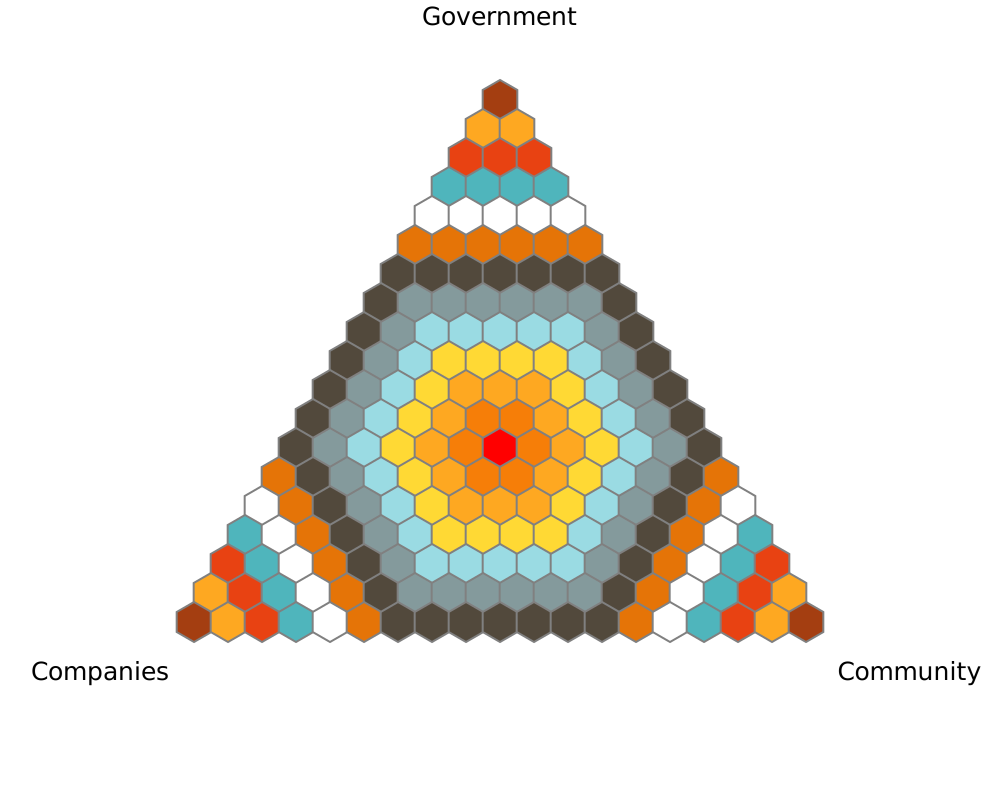

# Balanced Prioritisation Tool for One Health Research

One Health is an interdisciplinary approach that recognizes the interconnectedness of human, animal, and environmental health. 

We created these tools to support our One Health research and in particular as part of our 'Oneography' study in Rokupr, Sierra Leone. A neologism, Oneography is an approach which uses descriptive, analytical and statistical methods to explore the perspectives of many stakeholders within the One Health framework. This study integrates both qualitative and quantitative approaches and aims to understand the relative prioritisations of One Health pillars in different sectors of a place, community or society.

The research instrument presented here is a 'game' for one or more player. This includes printed aluminium gameboards and 3D printed play-pieces.

The main purpose is to provide a framework for researchers to have conversations with stakeholders by using a tool which forces them to make a choice that balances resources between the various pillars of one health or actors involved in governance of One Health. The player(s) move one or more pawns around the board, and movement towards one corner shows their heightened valuation of that 'pillar'. This comes at a cost to the other two aspects. The final placement of the pawn is recorded using an image-map within and ODK form. In keeping with our Oneography method, the process of discussion, movement and collaboration when making judgement decisions is as much a part of the research as the quantitative measure of the final pawn placements. 

Core to the function of the quantitative aspect is the use of an SVG 'image-map' which is an interactive image that allows pawn placements on the real-world game board to be recorded on a digital twin within an ODK XLSForm. 

## Game Boards

We created two game boards, one which balances proritisation of animal, human and environmental health; the other which balances the roles of government, communities and industry. 
The game boards were designed in Affinity Designer with imagery created by Dall-E by ChatGPT.

## Play Pieces
We created home made play pieces using a 2 colour 3D printer. OpenSCAD and STL files for these pieces are included in [3D_Printing_Designs](3D_Printing_Designs)
## Image Maps

We created a python script to generate the core hexagon matrix that serves as the central game-space. 
[python_script_generate_hexmap/trigram_generator_hexagons_central_origin.py](python_script_generate_hexmap/trigram_generator_hexagons_central_origin.py)
If you need a differently sized game-board, you can modify the matrix by changing the settings in the python code. 

Using Inkscape and BBEDit, we modified the image maps to include colour. The presence of colours really helps when transliterating data from the game board to the ODK Form. 

## Creating am matrix

This tool, found in the /tda folder includes a customisable python script which creates an SVG for image-map type questions in ODK Ecosystem platforms.

The script creates a ternary diagram with three variables. The main triangle consists of a 19x19 hexagonal map.
In ODK, the hexagons (which are painted transparently in SVG) become clickable and are mapped to a co-ordinate system which measures the triangular distance from the central hexagon. 

The coordinates are a Hamming distance metric, so the furthest extreme corners are 12 edges away from the central point.

The topmost apex is then the three vertexes are at 

top   :  -6,-6,12  
left  :  -6,12,-6  
right :  12,-6,-6  

As you can see, a higher value in one vertex is associated with a lower score in the other two dimensions.
This means that the scores on each 'axis' are not numerically important per se, but rather that the relationships between the numbers mean something
It also provides for a pretty easy to understand visual device.

You can probably easily transpose this to a square chart by doubling all the negative numbers on account of those coming from the side of the triangle that's half as long as the other one. 

https://github.com/user-attachments/assets/551da741-6dda-4a41-8d1c-3434fce3ae3e

